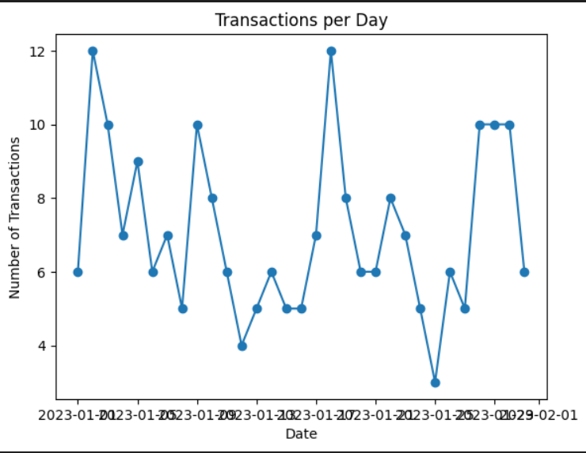
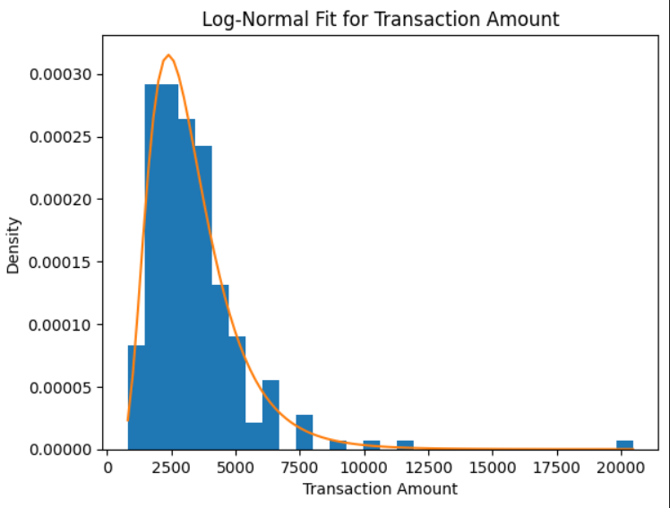

# 📊 E-Commerce Transaction Statistical Distribution Analysis

## 📌 Project Description

This project analyzes **customer transaction behavior** on an e-commerce platform using statistical distribution techniques.
The aim is to understand how transaction amounts behave, identify patterns in the data, and apply probability concepts to derive meaningful business insights.

The complete analysis is implemented in **Python using Jupyter Notebook**.

---

# 🎯 Objective

The objective of this project is to:

* Understand **probability distributions**
* Perform **spread analysis**
* Apply **statistical transformations**
* Analyze transaction patterns
* Generate insights for decision making

This project demonstrates how statistical techniques can be applied to real-world transaction datasets.

---

# 📁 Project Structure

```
project-folder
│
├── PR-4.ipynb
├── spread_locator_dataset.csv
└── README.md
```

| File                       | Description                               |
| -------------------------- | ----------------------------------------- |
| PR-4.ipynb                 | Contains full analysis and visualizations |
| spread_locator_dataset.csv | Dataset used in this project              |
| README.md                  | Project documentation                     |

---

# 🔗 Dataset Link

- [spread_locator_dataset.csv](spread_locator_dataset.csv)

Replace **YOUR_USERNAME** and **YOUR_REPOSITORY** with your GitHub details.

---

# 📊 Dataset Information

The dataset contains information about customer transactions.

| Column             | Description                           |
| ------------------ | ------------------------------------- |
| transaction_id     | Unique identifier of each transaction |
| customer_id        | Unique identifier of customer         |
| transaction_amount | Total transaction value               |
| transaction_date   | Date of transaction                   |
| transaction_count  | Weekly number of transactions         |
| region             | Customer geographic region            |
| transaction_status | Transaction success or failure        |

---

# 📚 Concepts Covered

### Statistical Distribution

A statistical distribution describes how values are spread across a dataset.

### Q-Q Plot

Used to determine whether data follows a normal distribution.

### Discrete vs Continuous Distribution

Discrete distributions represent countable data while continuous distributions represent measurable quantities.

### Bernoulli Distribution

Represents events with two outcomes such as success or failure.

### Binomial Distribution

Models the number of successes in repeated experiments.

### Log-Normal Distribution

If the logarithm of a variable follows a normal distribution, the variable is log-normally distributed.

### Power Law Distribution

Describes relationships where large events are rare but impactful.

### Box-Cox Transformation

Used to stabilize variance and normalize skewed data.

### Poisson Distribution

Used for modeling event counts over a fixed interval.

### Z-Score

Indicates how many standard deviations a value is from the mean.

### PDF vs CDF

PDF shows likelihood of a value while CDF shows cumulative probability.

---

# 🔬 Analysis Performed

The following statistical techniques were applied in **PR-4.ipynb**:

* Bernoulli Distribution
* Binomial Distribution
* Poisson Distribution
* Log-Normal Distribution
* Power Law Distribution
* Q-Q Plot for normality testing
* Box-Cox Transformation
* Z-score probability calculation
* PDF and CDF visualization

---

# 📈 Key Insights

* Transaction amounts show **skewed distribution**.
* Log-normal distribution fits the data better.
* High-value transactions are relatively rare.
* Some regions have higher transaction activity.

These insights help businesses in improving decision making and understanding customer behavior.

---

# 🛠 Tools & Technologies

* Python
* Pandas
* NumPy
* SciPy
* Statsmodels
* Matplotlib
* Seaborn
* Jupyter Notebook


# 📷 Project Preview

You can add screenshots like this:

- 
- 
- 
- 

# 📌 Conclusion

This project demonstrates how statistical distributions and probability theory can be applied to real-world transaction datasets. The analysis helps uncover transaction patterns and provides insights useful for business intelligence and data-driven decision making.

---

# 👨‍💻 Author
Janki Dholariya
